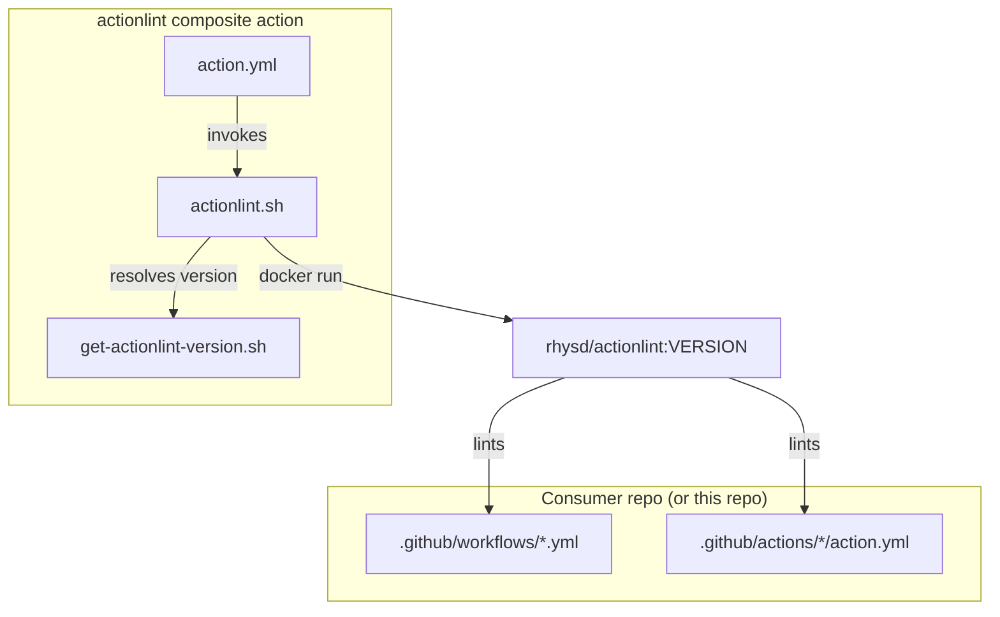
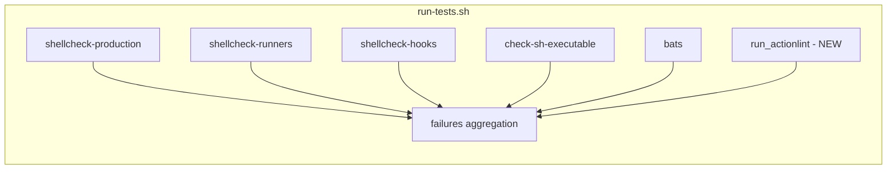
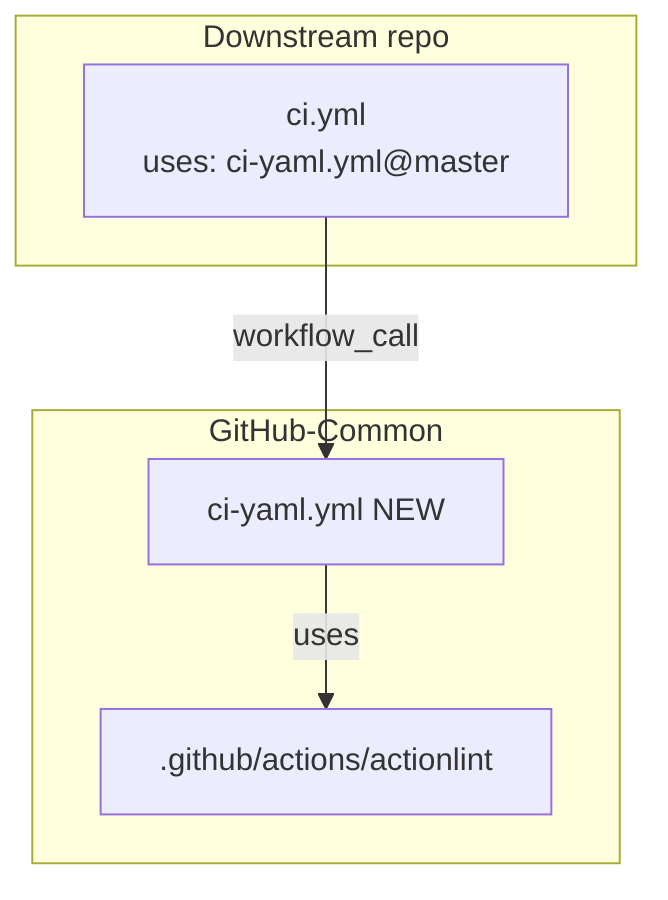

# Plan: Lint YAML workflows

Context: [problem.md](problem.md). Existing patterns to mirror:
[shellcheck-bash action](../../../.github/actions/shellcheck-bash/),
[bats version accessor](../../../.github/lib/get-bats-version.sh),
[scripts/run-tests.sh](../../../scripts/run-tests.sh),
[ci-bash.yml](../../../.github/workflows/ci-bash.yml).

## Index

- [Step 1 - Pin actionlint version](#step-1---pin-actionlint-version)
- [Step 2 - Add actionlint composite action](#step-2---add-actionlint-composite-action)
- [Step 3 - Wire actionlint into local runner](#step-3---wire-actionlint-into-local-runner)
- [Step 4 - Add reusable ci-yaml.yml workflow](#step-4---add-reusable-ci-yamlyml-workflow)

Note: README is updated as part of each step that changes a user-visible
surface, not as a trailing step. Actionlint findings surfaced during any
step are fixed in-line as part of that step.

## Step 1 - Pin actionlint version

Add `ACTIONLINT_VERSION` to
[.github/lib/versions.env](../../../.github/lib/versions.env) and create
`.github/lib/get-actionlint-version.sh` mirroring
[get-bats-version.sh](../../../.github/lib/get-bats-version.sh).

**Reason:** every other pinned tool in the repo flows through
`versions.env` via a dedicated getter so the composite action and the
local runner cannot drift. Reusing this pattern keeps version bumps to
a single line.

**Tests:**
- `get-actionlint-version.bats` next to the script:
  - Prints `ACTIONLINT_VERSION` from `versions.env` with no argument.
  - Echoes the override verbatim when one is passed.
  - Exits non-zero if `ACTIONLINT_VERSION` is unset (set -u behaviour).

## Step 2 - Add actionlint composite action

Create `.github/actions/actionlint/` with `action.yml` and
`actionlint.sh`. The action:

- Resolves the pinned version via
  `.github/lib/get-actionlint-version.sh`.
- Runs `actionlint` over the caller repo's `.github/workflows/` and
  `.github/actions/` (skip silently if a directory is absent, same as
  `shellcheck-bash`).
- Uses the `rhysd/actionlint:<version>` Docker image. Same Docker-only
  approach the runner falls back to; no native install path needed in
  CI because the image is small and pinned.

**Reason:** packaging as a composite action lets downstream repos call
it as `uses: VitaliiAndreev/GitHub-Common/.github/actions/actionlint@master`
with no Docker boilerplate at the call site, matching how
`shellcheck-bash` and `test-bats` are exposed.

**Tests:**
- `actionlint.bats` next to the script:
  - Exits 0 on a fixture workflow with no findings.
  - Exits non-zero on a fixture workflow with a known schema error
    (e.g. invalid `runs-on:` value).
  - Skips silently when neither `.github/workflows/` nor
    `.github/actions/` exists.



## Step 3 - Wire actionlint into local runner

Extend [scripts/run-tests.sh](../../../scripts/run-tests.sh) with a
`run_actionlint` function, added to the `failures` aggregation block
alongside the existing shellcheck/bats checks. Image variable
`ACTIONLINT_IMAGE` resolved via the getter, same shape as
`BATS_IMAGE`.

**Reason:** the local runner is the pre-push gate; every CI check must
be reproducible locally per the existing dual-track pattern, so a
developer can fix findings without round-tripping through the remote.

**Tests:** no new unit tests for this wiring (the function is a thin
shell over the composite action's helper; coverage lives at the
helper-level bats from step 2). Smoke-test by running
`scripts/run-tests.sh` and confirming an `=== actionlint ===` section
appears and passes.



## Step 4 - Add reusable ci-yaml.yml workflow

Create `.github/workflows/ci-yaml.yml` mirroring
[ci-bash.yml](../../../.github/workflows/ci-bash.yml). Single job
`actionlint` calls `./.github/actions/actionlint`. `on:` triggers:
`pull_request` and `workflow_call` (no inputs needed - the composite
action already self-resolves its version).

**Reason:** keeps the bash and YAML lint surfaces in separate workflows
so a YAML-only change does not show "ci-bash" in the PR check list, and
consumers can opt in independently. Consumer wiring:

```yaml
jobs:
  yaml:
    uses: VitaliiAndreev/GitHub-Common/.github/workflows/ci-yaml.yml@master
```

**Tests:** validated by Step 5 - the very first CI run of this workflow
on this repo must pass (after Step 5 fixes), otherwise the bar is set
incorrectly. Document this expectation in the workflow header comment.



